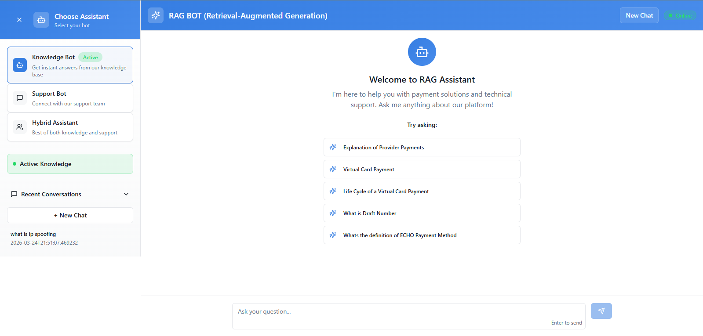

# Hybrid RAG Knowledge Base Chatbot

This project is a Retrieval-Augmented Generation (RAG) based chatbot that allows users to query PDF documents using a local Large Language Model (LLM). The system performs hybrid document retrieval using both vector similarity search and BM25 keyword search before generating answers using a local LLM via Ollama.

---

## Application Screenshots

### Chat Interface

### Chat Response Example

---

## Architecture Overview

The system works in two phases:

### 1. Indexing Phase
PDF Documents → Text Extraction → Chunking → Embeddings → Stored in Chroma Vector Database

### 2. Query Phase
User Question → Hybrid Retrieval (Vector + BM25) → Relevant Chunks → LLM → Generated Answer

---

## Tech Stack

**Backend**
- Python
- FastAPI
- LangChain
- ChromaDB (Vector Database)
- Sentence Transformers (Embeddings)
- BM25 Retrieval
- Ollama (Local LLM)

**Frontend**
- React
- Vite
- Tailwind / ShadCN UI

---

## Project Structure

RAG-BOT/
│
├── BACKEND/
│ └── secure_rag_chatbot_filelog-GPU/
│ ├── app/
│ ├── utils/
│ ├── app.py
│ ├── generator.py
│ ├── hybrid_retriever.py
│ ├── rebuild_vectorstore.py
│ ├── requirements.txt
│
├── UI/
│ ├── src/
│ ├── package.json
│
├── README.md
├── .gitignore

---

## Setup Instructions

### 1. Clone Repository
git clone https://github.com/yourusername/hybrid-rag-chatbot.git
cd hybrid-rag-chatbot

---

### 2. Backend Setup

Navigate to backend folder:
cd BACKEND/secure_rag_chatbot_filelog-GPU

Create virtual environment:
python -m venv venv

Activate virtual environment:
venv\Scripts\activate

Install dependencies:
pip install -r requirements.txt

---

### 3. Install Ollama
Download and install Ollama from:
https://ollama.com

Pull a model:
ollama pull phi3

or
ollama pull llama3

Make sure Ollama is running.

---

### 4. Build Vector Database
Place your PDFs inside:
app/data/knowledge

Then run:
python rebuild_vectorstore.py

This will create embeddings and build the vector database.

---

### 5. Run Backend Server
python app.py

Backend will start at:
http://127.0.0.1:8000

---

### 6. Run Frontend
Open new terminal:
cd UI
npm install
npm run dev

Frontend will run at:
http://localhost:8080

---

## How the System Works

1. Documents are converted into embeddings and stored in Chroma vector database.
2. When a user asks a question, the system retrieves relevant document chunks using:
   - Vector similarity search
   - BM25 keyword search
3. Hybrid scoring combines both retrieval methods.
4. Retrieved context is sent to a local LLM running via Ollama.
5. The LLM generates the final answer.
6. The answer is displayed in the chat UI.

---

## Features

- PDF knowledge base chatbot
- Hybrid retrieval (Vector + BM25)
- Local LLM inference using Ollama
- FastAPI backend
- React frontend
- Chat history
- Image extraction from PDFs
- Offline document QA system

---

## Future Improvements

- Add reranking model
- Add user authentication
- Deploy backend
- Add streaming responses
- Add multi-document comparison
